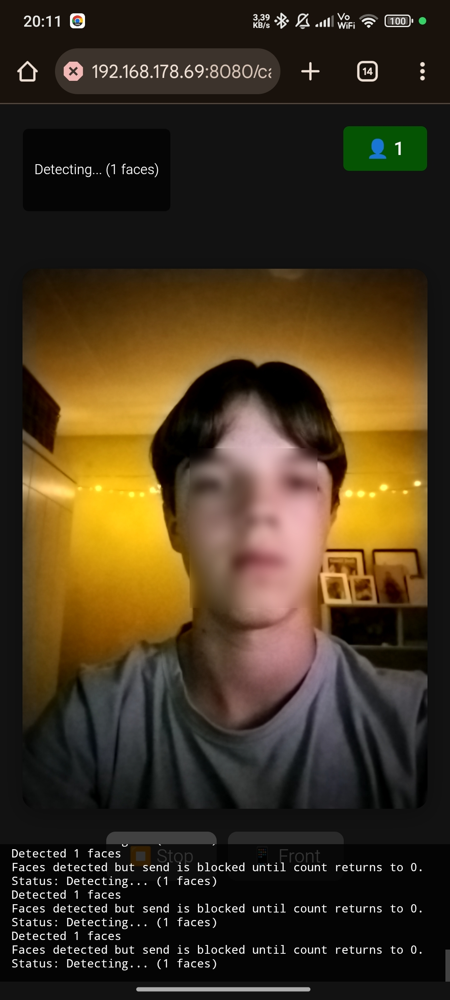
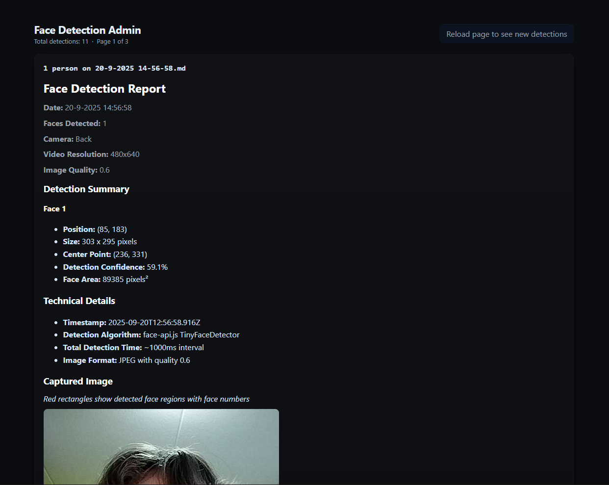

```
|||||||||||||||||||||||||||||||||||||||||||
|||                                     |||
|||      ____  _ _       _              |||
|||     | __ )| (_)_ __ | | ___   _     |||
|||     |  _ \| | | '_ \| |/ / | | |    |||
|||     | |_) | | | | | |   <| |_| |    |||
|||     |____/|_|_|_| |_|_|\_\\__, |    |||
|||                           |___/     |||
|||      A lovely screensaver pet       |||
|||                                     |||
|||||||||||||||||||||||||||||||||||||||||||
```

[](https://matthias.is-a.dev)     

> **"The world's friendliest screensaver pet!"** 🐾✨  
> *Turn any screen into an adorable companion that watches over your space with curious, blinking eyes!*

A delightfully interactive screensaver that brings personality to any display! Blinky features animated eyes that react to real faces detected through your phone's camera, creating a charming digital pet that's always watching and responding to the world around it.


## ✨ What makes Blinky special?

🎯 **Smart & Simple**: Blinky transforms any boring screen into an engaging digital companion! Using clever WebSocket magic, it connects your phone's camera to a pair of adorable animated eyes on your main display.

🔮 **How the magic works**: 
- 📱 Your phone becomes a smart camera that detects faces in real-time
- 👀 Blinky's eyes on your main screen react instantly when someone walks by  
- 💭 Watch as Blinky shows thought bubbles and expressions when faces are detected
- 🌐 All connected seamlessly through WebSocket technology

🏆 **Perfect for**:
- 💼 Your work desk setup (make meetings more fun!)
- 🏪 Shop windows (attract customers with personality!)
- 🏢 Office spaces (add character to boring hallways!)
- 🪞 Smart mirror projects (because mirrors should be interactive!)
- 🎨 Art installations (digital art that responds to viewers!)
- 🏠 Anywhere that needs a bit more personality and life!

## 🚀 Quick Start (Get Blinky Running in 5 Minutes!)

Ready to bring your screen to life? Follow these simple steps:

### 📋 Prerequisites
- ✅ Node.js 18+ installed ([Download here](https://nodejs.org/))
- ✅ OpenSSL installed ([Download here](https://openssl-library.org/source/))

### 🛠️ Setup Steps

1. **📥 Get the code**
   ```bash
   git clone https://github.com/MatthiasLubbertsen/blinky.git
   cd blinky
   ```

2. **🔐 Generate SSL certificate** (needed for camera access)
   ```bash
   mkdir -p certs
   ```
   ```bash
   openssl req -x509 -nodes -days 365 -newkey rsa:2048 -keyout certs/server.key -out certs/server.cert -subj "/C=US/ST=CA/L=SF/O=Blinky/OU=Blinky/CN=localhost"
   ```

3. **📦 Install dependencies**
   ```bash
   npm install
   ```

4. **🎉 Start Blinky!**
   ```bash
   npm start
   ```


## 📱 How to Use Blinky

### 🖥️ Step 1: Set up the main display
Open `https://YOUR_IP:8080` in Chrome on your computer or laptop (larger screens work best!).
- 🔒 You'll see a security warning (normal with self-signed certificates!)
- Click **"Advanced"** → **"Proceed to [your-ip] (unsafe)"**
- 🎉 Blinky's eyes will appear and start their gentle blinking animation
- The eyes automatically connect via WebSocket to the backend to wait for face detection events

### 📷 Step 2: Connect your phone camera  
Open `https://YOUR_IP:8080/camera` on your phone or tablet.
- 🔒 Accept the security warning (same as before)
- 📸 Grant camera permission when prompted
- 👉 Tap **"Start Detection"** 
- The camera view will show with face detection rectangles when faces are found

### 🎭 Step 3: Watch the magic happen!
- 👋 Walk in front of your phone camera
- 👀 Watch Blinky's eyes react instantly on the main screen!
- 💭 Blinky will show thought bubble messages when faces are detected *(contributions welcome!)*
<!-- - 😊 The more faces detected, the more excited Blinky gets! -->
- 📸 Each detection is logged and saved in the `detections/` folder for later viewing at the admin panel

**🎊 That's it! You now have your very own digital pet watching over your space!**

---

### 📸 Screenshots

**🖥️ Blinky's Main Interface:**


> 💡 **Pro tip**: Best viewed on larger screens for maximum cuteness impact!

**📱 Phone Camera Interface:**


> 💡 **Pro tip**: The face shown is blurred for privacy, but Blinky sees faces clearly in the real app!

**🛠️ Admin Interface:**


> 💡 **Pro tip**: Use the admin interface to view detection logs and statistics!

---

### 🕹️ Extra Info

**🎯 Different Viewing Modes:**
- 🏠 **Main App** (`/`) - Full Blinky experience with face detection reactions
- 👁️ **Just Blink** (`/just_blink.html`) - Simple blinking eyes without face detection  
- 🧪 **Test Counter** (`/test_counter.html`) - Debug face detection counts
- 👨‍💻 **Admin Panel** (`/admin`) - View face detection logs and stats

### 📂 Project Structure
- 👁️ `index.html` - The main Blinky application with reactive eyes
- 📱 `phone.html` - Camera interface for face detection (use /camera on the camera device, not /phone.html!)
- 😊 `just_blink.html` - Simple blinking animation (no face detection)
- 🧪 `test_counter.html` - Face detection testing utility
- 🔧 `working_version_with_local_camera.html` - Local camera version (not up-to-date (yet))
- 🤖 `face-api.min.js` - Face detection AI library

## 🔒 Privacy & Security Notes

⚠️ **Important**: Blinky currently doesn't implement face anonymization or data encryption. 

If you're planning to use this in public spaces, please consider:
- 🔐 Adding face anonymization features *(contributions needed!)*
- 📜 **This project currently does NOT comply with local privacy laws (GDPR/CCPA)**
- 🏢 Check your local regulations before deploying in commercial spaces

**Disclaimer**: The author is not responsible for any data collected or published using this software. Use responsibly! 

## 🎨 Customization Ideas

Want to make Blinky your own? Here are some fun ideas:
- 💬 Customize the thought bubble messages *(contributions welcome!)*
- 🌈 Create different eye styles for different moods *(contributions welcome!)*
- 📊 Add analytics to track visitor engagement *(contributions welcome!)*
- 🎪 Create themed versions (Easter eyes, holiday decorations, etc.) *(contributions welcome!)*

**🚀 Send a PR or open an issue with your ideas! 💡**

## 📄 License & Credits

📋 **MIT License + Attribution Required**

If you use or modify Blinky, please credit Matthias Lubbertsen by linking to:
- 🐙 [GitHub Profile](https://github.com/MatthiasLubbertsen)
- 🌐 [Personal Website](https://matthias.is-a.dev)

See the full license in [LICENSE.md](LICENSE.md)

---

## 🙏 Credits & Acknowledgments

- 🤖 **Face Detection**: Powered by the **amazing** [face-api.js](https://github.com/justadudewhohacks/face-api.js) by @justadudewhohacks
- 💡 **Inspiration**: Every digital pet deserves a chance to watch over their humans
- 🤖 **Copilot**: About 80% of the code was written with the help of [GitHub Copilot](https://github.com/copilot), thanks to their free Pro plan for students!
- 🛠️ **Tools**: Built using Node.js, Express, and WebSocket technologies

---

## 🤝 Contributing

Love Blinky? Want to make it even better? 

- 🐛 **Found a bug?** [Open an bug issue](https://github.com/MatthiasLubbertsen/blinky/issues/new?template=bug_report.md)
- 💡 **Have ideas?** [Open an feature request issue](https://github.com/MatthiasLubbertsen/blinky/issues/new?template=feature_request.md)  
- 🔧 **Want to contribute?** Check out the existing issues/PR's and our [Contributing Guide](CONTRIBUTING.md)

**Popular contribution ideas:**
- 🔐 Face anonymization features
- 🎨 More eye animations
- 📱 Better mobile camera interface
- 🌍 Multi-language support

---

<div align="center">

**⭐ Star this repo if Blinky brought a smile to your face! ⭐**

*Made with ❤️ by [Matthias Lubbertsen](https://github.com/MatthiasLubbertsen)*

</div>